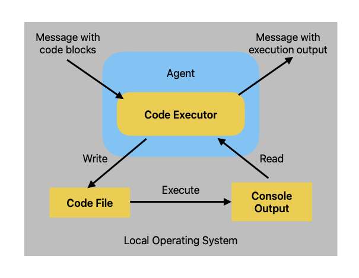

+++
title = 'AutoGen学习笔记'
date = 2024-09-04T20:47:24+08:00
description = "学习AutoGen的一些简单笔记和大致框架"
draft = false
math = true
comments = false
categories = [
	"Master Life",
	"Learning"
]
tags = [
	"LLM",
	"AutoGen"
]
+++

## AutoGen的安装
*基于`conda`*
```bash
conda create -n pyautogen python=3.10
conda activate pyautogen
# (optional, run on jupyter) conda install ipykernel -y
# (optional, formatter plugin) conda install black -y
pip install pyautogen
```

## 常见概念
### `OAI_CONFIG_LIST`
调用OpenAI的API常用配置文件，用于指定如何连接到OpenAI的服务，比如API密钥、端点URL等信息。

### `top_p`和`temperature`参数
`top_p`有时也称`nucleus sampling`，这两个参数都是用来控制生成文本的随机性和多样性，但它们的作用方式有所不同。
- **temperature**
    - `temperature` 参数决定了模型从候选词汇中选择下一个词的方式。它调整了概率分布的形状，从而影响模型的选择倾向。通常设定范围为 $[0,1]$
    - 当 `temperature` 接近0时，模型倾向于选择最有可能的词，这导致生成的文本更可预测但可能较乏味。
    - 当 `temperature` 较高时，模型更倾向于随机选择，这样增加了生成文本的多样性和新颖性，但可能导致生成的句子不够连贯或者含有更多错误。
- **top_p (Nucleus Sampling 核心采样)**
    - `top_p` 是一种采样策略，它并不改变概率分布本身，而是首先从概率分布中选取累积概率总和达到 `p` 值的最高概率词汇子集。
    - 比如说，如果 `top_p` 设置为0.9，那么模型将会只考虑那些累积概率之和达到或超过90%的词汇。
    - 在这些词汇中，再根据它们相对的概率分布进行采样。这种方式既保持了一定的多样性，又避免了选择那些极不可能出现的词汇，有助于提升生成文本的质量。
#### 联系
- 它们都是为了调整生成文本的随机性与创造性之间的平衡。
- 使用者可以通过调整这两个参数来优化生成的文本质量，使其更符合特定的应用场景。
#### 区别
- `temperature` 是通过改变概率分布来影响生成结果，而 `top_p` 则是在不改变分布的情况下，仅选择部分高概率词汇进行采样。
- `temperature` 更多地控制了输出的探索性（exploration），即在概率分布中的冒险程度；而 `top_p` 则更多地控制了输出的稳健性（exploitation），即在已知的高概率选项中进行选择。
*不建议两者同时修改*
## LLM配置
[Official Documentation](https://microsoft.github.io/autogen/docs/topics/llm_configuration)
建议采用`OAI_CONFIG_LIST`方式，方便多个API和模型的切换
```python
config_list = autogen.config_list_from_json(  
	env_or_file="OAI_CONFIG_LIST",
	filter_dict={"model":["gpt-4"]} # 选择模型
)

llm_config = {
    "config_list": config_list
	"timeout":120
}
```
- 在配置时，最好加入`"timeout"`字段，由于网络连接的缘故，如果不设定此字段，容易出现`connection error`问题
- 如果api调用过慢，建议使用`gpt-3.5`系列模型以到达低时延的目的。(但是3.5版本比较笨，只能用于学习测试，其他目的慎用)，即使是`gpt-4o-mini`也会出现知识幻觉，这一系列模型感觉都是更加注重增加可传入`token`的数量，而在智能程度上还不够
## 终止Agents之间对话的方式
[Documentation](https://microsoft.github.io/autogen/docs/tutorial/chat-termination/)
### 在`initiate_chat`函数中设定参数
e.g.
```python
result = joe.initiate_chat(cathy, message="Cathy, tell me a joke.", max_turns=2)
```
代码中的`max_turns`即表示代理进行多少轮(**例如`max_turns=2`代表每个agent说出两句话**)对话后停止对话。

### 在创建agent时设定参数
有以下两个参数可以进行设定：
1. `max_consecutive_auto_reply`：在`ConversableAgent`类中可以设定此参数，当此代理对同一个发信代理的**响应次数**(*注意不是接受消息次数*)到达一定数量时，就终止对话。(*疑问：终止的方式是什么？是直接不说话，还是说出结束语？*)
2. `is_termination_msg`：检查收到的回复中是否存在结束语，e.g.
```python
joe = ConversableAgent(
    "joe",
    system_message="Your name is Joe and you are a part of a duo of comedians.",
    llm_config={"config_list": [{"model": "gpt-4", "temperature": 0.7, "api_key": os.environ.get("OPENAI_API_KEY")}]},
    human_input_mode="NEVER",  # Never ask for human input.
    is_termination_msg=lambda msg: "good bye" in msg["content"].lower(),
)

result = joe.initiate_chat(cathy, message="Cathy, tell me a joke and then say the words GOOD BYE.")

```

## 人工参与输入
### 人工输入的逻辑
人工输入处于agent_auto_reply的逻辑流程前面，也就是人工输入可以对传入消息进行拦截。
(*个人理解*)：例如，`Agent A`给`Agent B`发送一条消息`msg_1`，但是可以通过人工输入将`msg_1`替换成`msg_2`，并将`msg_2`传给`Agent B`。

### 输入模式
通过`Conversable`构造函数中的`human_input_mode`来设定
1. `human_input_mode=NEVER`
2. `TERMINATE`：当终止条件满足时(例如：`max_consecutive_auto_reply`或者`is_termination_msg`满足时)，便请求人工输入。并且在`max_consecutive_auto_reply`情况下，人工输入后计数器会被重置。反之，如果人工选择跳过人工输入，那么agent将会继续auto_reply机制。另外，人工也可以选择终止对话
3. `ALWAYS`：可以选择跳过人工输入并依然使用auto_reply，或者拦截auto_reply并提供反馈(包括终止对话)。在此模式下，`max_consecutive_auto_reply`将失效

### 示例
*以下例子充分证明了，gpt-3.5、gpt-4o-mini的推理能力较差，只有gpt-4能够正确地完成猜数游戏。*
#### `NEVER`
```python
agent_with_number = ConversableAgent(
    "agent_with_number",
    system_message="You are playing a game of guess-my-number. You have the "
    "number 53 in your mind, and I will try to guess it. "
    "If I guess too high, say 'too high', if I guess too low, say 'too low'. ",
    llm_config=llm_config,
    is_termination_msg=lambda msg: "53" in msg["content"],  # terminate if the number is guessed by the other agent
    human_input_mode="NEVER",
)

agent_guess_number = ConversableAgent(
    "agent_guess_number",
    system_message="I have a number in my mind, and you will try to guess it. "
    "If I say 'too high', you should guess a lower number. If I say 'too low', "
    "you should guess a higher number. ",
    llm_config=llm_config,
    human_input_mode="NEVER",
)

result = agent_with_number.initiate_chat(
    agent_guess_number,
    message="I have a number between 1 and 100. Guess it!",
)
```
在`agent_guess_number`的`system_message`中，限定让其使用二分法(`binary search`)，可使其更快更准确得出答案，这就是RAG的一个例子(*作为ppt汇报例子：RAG原理之一-增强LLM prompt*)

#### `TERMINATE`
```python
agent_with_number = ConversableAgent(
    "agent_with_number",
    system_message="You are playing a game of guess-my-number. "
    "In the first game, you have the "
    "number 53 in your mind, and I will try to guess it. "
    "If I guess too high, say 'too high', if I guess too low, say 'too low'. ",
    llm_config=llm_config,
    max_consecutive_auto_reply=1,  # maximum number of consecutive auto-replies before asking for human input
    is_termination_msg=lambda msg: "53" in msg["content"],  # terminate if the number is guessed by the other agent
    human_input_mode="TERMINATE",  # ask for human input until the game is terminated
)

agent_guess_number = ConversableAgent(
    "agent_guess_number",
    system_message="I have a number in my mind, and you will try to guess it. "
    "If I say 'too high', you should guess a lower number. If I say 'too low', "
    "you should guess a higher number. ",
    llm_config=llm_config,
    human_input_mode="NEVER",
)

result = agent_with_number.initiate_chat(
    agent_guess_number,
    message="I have a number between 1 and 100. Guess it!",
)
```
此例子的逻辑是，利用人工输入后会重置`max_consecutive_auto_reply`这一特性，`agent_with_number`只能回复一次`too high`或者`too low`，如果猜错则由人工接管回答`too high`或者`too low`。

#### `ALWAYS`
人工扮演猜数者
```python
human_proxy = ConversableAgent(
    "human_proxy",
    llm_config=False,  # no LLM used for human proxy
    human_input_mode="ALWAYS",  # always ask for human input
)

# Start a chat with the agent with number with an initial guess.
result = human_proxy.initiate_chat(
    agent_with_number,  # this is the same agent with the number as before
    message="10",
)
```
## Code Executor
Code Executor组件接收输入消息(例如，包含代码块的消息)，执行并输出带有结果的消息。AutoGen 提供了两种类型的内置代码执行程序
- 命令行代码执行程序，在 UNIX shell 等命令行环境中运行代码
- 在交互式 Jupyter 内核中运行代码。
对于每种类型的Code Executor，都有两种执行方式：本地执行和在Docker中执行。

### CLI执行和Jupyter执行的选择
命令行和 Jupyter 代码执行程序之间的选择取决于代理对话中代码块的性质。如果每个代码块都是一个“脚本”，它不使用以前代码块中的变量，那么命令行代码执行程序是一个不错的选择。如果某些代码块包含昂贵的计算（例如，训练机器学习模型和加载大量数据），并且希望将状态保留在内存中以避免重复计算，则 Jupyter 代码执行程序是更好的选择。
### 本地执行逻辑以及VSCode中Jupyter执行


#### Jupyter in VSCode执行
```python
from autogen.coding import CodeBlock
from autogen.coding.jupyter import JupyterCodeExecutor, LocalJupyterServer
from autogen import ConversableAgent


with LocalJupyterServer() as server:
    executor = JupyterCodeExecutor(server)

    code_executor_agent = ConversableAgent(
        "code_executor_agent",
        llm_config=False,  # Turn off LLM for this agent.
        code_execution_config={
            "executor": executor
        },  # Use the local command line code executor.
        human_input_mode="NEVER",  # Always take human input for this agent for safety.
    )
    message_with_code_block = """This is a message with code block.
        The code block is below:
        ```python
        print("Jupyter Code Executor test")
        ```
        This is the end of the message.
        """

    # Generate a reply for the given code.
    reply = code_executor_agent.generate_reply(
        messages=[{"role": "user", "content": message_with_code_block}]
    )
    print(reply)
'''
output:
>>>>>>>> EXECUTING CODE BLOCK (inferred language is python)... exitcode: 0 (execution succeeded) Code output: Jupyter Code Executor test
'''
```
Note:
- 在jupyter中使用Code Executor相较于CLI执行`.py`文件，要多一步连接Jupyter内核，也就是`with LocalJupyterServer() as server`这一步骤。连接内核后，再用此连接创建`JupyterCodeExecutor`。
- 在使用Jupyter执行时要先安装依赖 `pip install 'pyautogen[jupyter-executor]'`
- Azure OpenAI API的Azure for Students无法执行[Use Code Executor in Coversation](https://microsoft.github.io/autogen/docs/tutorial/code-executors#use-code-execution-in-conversation)的代码，原因是token超出限制(1k tokens per minutes)。虽然可以修改`code_writer_system_message`，尽量精简化其内容使得token数量少一点可以成功运行示例代码，但是prompt不够会导致结果不够准确。

## Tool Use
Agent写出的代码可靠性并不高，所以需要借助一些工具。AutoGen中tools是一些agent可以使用的已经预定义好了的函数。Agent能借助工具完成诸如搜索网页、计算、读取文件或者调用远程API的功能。

### 创建工具
Tools可以像创建普通Python函数一样进行创建：
```python
from typing import Annotated, Literal

Operator = Literal["+", "-", "*", "/"]


def calculator(a: int, b: int, operator: Annotated[Operator, "operator"]) -> int:
    if operator == "+":
        return a + b
    elif operator == "-":
        return a - b
    elif operator == "*":
        return a * b
    elif operator == "/":
        return int(a / b)
    else:
        raise ValueError("Invalid operator")
```
> Tips: 最好多使用类型提示来定义函数的参数和返回值，这也是对agent提供的一种prompt

### 注册工具
创建好某个tool后，再向agent注册该tool就可以在对话中调用此tool
```python
import os

from autogen import ConversableAgent

# Let's first define the assistant agent that suggests tool calls.
assistant = ConversableAgent(
    name="Assistant",
    system_message="You are a helpful AI assistant. "
    "You can help with simple calculations. "
    "Return 'TERMINATE' when the task is done.",
    llm_config={"config_list": [{"model": "gpt-4", "api_key": os.environ["OPENAI_API_KEY"]}]},
)

# The user proxy agent is used for interacting with the assistant agent
# and executes tool calls.
user_proxy = ConversableAgent(
    name="User",
    llm_config=False,
    is_termination_msg=lambda msg: msg.get("content") is not None and "TERMINATE" in msg["content"],
    human_input_mode="NEVER",
)

# Register the tool signature with the assistant agent.
# (calculator)是装饰器的用法
assistant.register_for_llm(name="calculator", description="A simple calculator")(calculator)

# Register the tool function with the user proxy agent.
user_proxy.register_for_execution(name="calculator")(calculator)
```
> Tips: 合理添加注释，帮助agent的LLM理解tool的作用

## 对话模式
AutoGen提供多个agent对话的组件。

### 概览
1. two-agent chat
2. sequential chat: 两个agent之间一系列的对话，对话可以将上一个对话的摘要带入下一个对话的上下文
3. Group Chat: 一个包含多个agent的对话，在这种情况下有一个很重要的问题：下一个说话的应该是哪一个agent？为了应对多种场景，autogen有多种方式来组织agent进行对话：
	- 多种选择下一个agent：`round_robin`, `random`, `manual`(人工选择)，以及自动选择(默认方式，使用一个LLM来决定)
	- 提供约束条件来限制下一个发言agent
	- 传入一个函数来自定义下一个agent。利用此特性，我们可以建立一个 **StateFlow** 来制定一个工作流。
4. Nested Chat: 将一个工作流打包进一个agent，并在其他工作流中重复使用该agent

