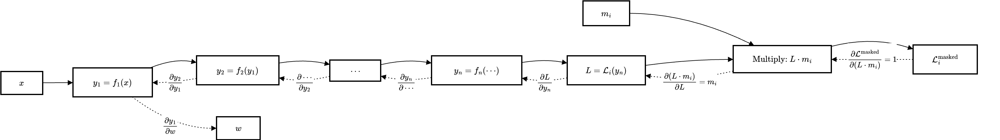

+++
categories = ['深度学习']
date = '2026-06-03T18:50:00+08:00'
draft = false
showToc = true
tags = ['PyTorch', '机器学习', 'Python']
title = 'PyTorch 核心概念与踩坑记录'
+++

## Quickstart: Creating Models

使用 `accelerator` 进行加速：

```python
import torch
import torch.nn as nn

device = torch.accelerator.current_accelerator().type if torch.accelerator.is_available() else "cpu"
print(f"Using {device} device")

# Define model
class NeuralNetwork(nn.Module):
    def __init__(self):
        super().__init__()
        self.flatten = nn.Flatten()
        self.linear_relu_stack = nn.Sequential(
            nn.Linear(28*28, 512),
            nn.ReLU(),
            nn.Linear(512, 512),
            nn.ReLU(),
            nn.Linear(512, 10)
        )

    def forward(self, x):
        x = self.flatten(x)	# model 的实际输入是在这里发生
        logits = self.linear_relu_stack(x)	
        return logits

model = NeuralNetwork().to(device)
print(model)
```

在 PyTorch（以及大多数深度学习框架）的习惯里，**`forward` 函数接收的输入默认是整个 batch 的数据**，而不是单个样本。

## Cross Entropy

以以下为例：

```python
import torch
from torch.nn import functional as F

logits = torch.tensor([[2, 0.1, 0.1], [0.1, 1, 0.1]])
labels = torch.tensor([0, 1])
loss = F.cross_entropy(logits, labels)
print(loss.item())

# output: 0.4283800423145294
```

其中：`[2, 0.1, 0.1]` 是对第一个样本（样本 `0`）的三个预测结果，对应 3 个类别的原始得分（logits）。假设分类中，一共有 3 类：类别 0，类别 1，类别 2。那么有：
- 2 是类别 0 的得分。
- 0.1 是类别 1 的得分。
- 0.1 是类别 2 的得分。

同样，`[0.1, 1, 0.1]` 是对第二个样本（样本 `1`）的预测结果，分别对应 3 个类别的得分。

PyTorch 的 `cross_entropy` 会自动将 logits 输入到 softmax 函数，计算各预测类别的概率，然后再算出交叉熵损失，因此我们不需要手动添加 softmax 层。

## `Dataset` 和 `DataLoader`

在使用如下方式加载数据时：

```python
for sample_id, query_embedding, pos_embeddings_list, neg_embeddings_list in tqdm(dataloader):
	pass
```

需要注意 `DataLoader` 会**自动给每个样本加上一维** `batch`。在写 `forward` 函数时需要**注意传入样本数据的维度**。

除此之外，`DataLoader` 既然会将多个样本组合成一个 `batch`，那么很自然地，`batch` 中的各个样本 `shape` 需要是一致的。如果不一致，需要手动传入 `collate_fn` 函数，供 `DataLoader` 控制 `batch` 中样本的处理和补齐。

### 示例：自定义 `collate_fn`

```python
def simple_collate_fn(batch):
    queries = torch.stack([item[0] for item in batch])  # [B, 4]
    max_len = max(len(item[1]) for item in batch)

    B = len(batch)
    facts = torch.zeros(B, max_len, 4)
    labels = torch.zeros(B, max_len)
    mask = torch.zeros(B, max_len)
    for i, (q, fact_list, label_list) in enumerate(batch):
        for j in range(len(fact_list)):
            facts[i, j] = fact_list[j]
            labels[i, j] = label_list[j]
            mask[i, j] = 1

    return queries, facts, labels, mask
```

## `Tensor` 操作

### `torch.stack`

`torch.stack` 沿着**新维度**连接张量序列（区别于 `torch.cat()`，后者是沿着**现有维度**连接给定的序列）。

```python
>>> x = torch.randn(2, 3)
>>> x
tensor([[ 0.3367,  0.1288,  0.2345],
        [ 0.2303, -1.1229, -0.1863]])
>>> torch.stack((x, x)) # same as torch.stack((x, x), dim=0)
tensor([[[ 0.3367,  0.1288,  0.2345],
         [ 0.2303, -1.1229, -0.1863]],

        [[ 0.3367,  0.1288,  0.2345],
         [ 0.2303, -1.1229, -0.1863]]])
>>> torch.stack((x, x)).size()
torch.Size([2, 2, 3])
```

### 广播机制 (Broadcast)

```python
mat = torch.tensor([[1, 2, 3, 4], [1, 2, 2, 2], [2, 3, 3, 3]])
mat.sum(dim=1, keepdim=True), mat / mat.sum(dim=1, keepdim=True)

# >>> (
# >>>     tensor([[10], 
# >>>             [7], 
# >>>             [11]]),
# >>>     tensor(
# >>>         [
# >>>             [0.1000, 0.2000, 0.3000, 0.4000],
# >>>             [0.1429, 0.2857, 0.2857, 0.2857],
# >>>             [0.1818, 0.2727, 0.2727, 0.2727],
# >>>         ]
# >>>     ),
# >>> )
```

这其中的过程是：
```python
mat_sum = tensor([[10], [7], [11]])

# 经过 broadcast 机制变成了:
mat_sum_broadcast = tensor([[10, 10, 10, 10], 
                            [7, 7, 7, 7], 
                            [11, 11, 11, 11]])
```

所以广播就是：在满足特定限制的前提下，**较小的数组“广播至”较大的数组**，使两者形状互相兼容。
可广播的一对张量需满足以下规则：
- 每个张量至少有一个维度。
- 迭代维度尺寸时，从**尾部**的维度开始，维度尺寸满足：
	- 或者**相等**
	- 或者**其中一个张量的维度尺寸为 1**
	- 或者**其中一个张量不存在这个维度**。

## 梯度 (Gradient)

在训练中: `W.grad` 就是指 $\frac{\partial(Loss)}{\partial(w_i)}$，但是这里并不是一个数学表达式，而是一个具体的数值（**即当前输入下的梯度数值**）。
带符号的表达式，例如 $\frac{dx^2}{dx}=2x$，这个叫做**符号求导**。

## Mask 机制

### 为什么在 loss 函数中 mask 乘以 padding 可以屏蔽掉梯度？

举个简单的例子：
无 mask 时：
- $z=w\cdot x$，$z$ 为预测值
- $L=\frac 12 (z-\hat z)^2=\frac12(w\cdot x-\hat z)^2$，$\hat z$ 为真实值；在链式法则中，中间变量为 $y_1=w\cdot x$

有 mask 时：
- $z=w\cdot x\cdot \text{mask}$
- $L=\frac 12 (z-\hat z)^2=\frac12(w\cdot x\cdot \text{mask}-\hat z)^2$，$\hat z$ 为真实值；在链式法则中，中间变量为 $y_1'=w\cdot x\cdot \text{mask}$

我们更新 $w$ 的方式为：

$$w \longleftarrow w - \eta \cdot \frac{\partial L}{\partial w}$$

展开来：

$$w - \eta \cdot \frac{\partial L}{\partial w} = w - \eta \cdot \frac{\partial L}{\partial y_1}\frac{\partial y_1}{\partial w}$$

在有 mask 的情况下展开结果为：

$$
w - \eta \cdot \frac{\partial L}{\partial w} = w - \eta \cdot \frac{\partial L}{\partial y_1'}\frac{\partial y_1'}{\partial w} = w - \eta \cdot \frac{\partial L}{\partial y_1'}\frac{\partial (w\cdot x\cdot \text{mask})}{\partial w}
$$

其中，如果对应的 token 是 padding（即 $\text{mask}=0$），$\frac{\partial (w\cdot x\cdot 0)}{\partial w} = 0$，这样就等于 $w = w - \eta \cdot 0$，梯度也就没有发生更新。

更广泛地来讲，通过使用 mask，$m_i=0$ 就使得整个梯度变为 $0$。而如果不使用 mask 仅仅做零填充（即使 $x=0$），当损失函数不为 MSE（例如使用了 Cross Entropy）时，依然会有梯度产生，无法彻底消除填充部分对梯度的影响。



### Mask 的弊端／风险

虽然 mask 是屏蔽 padding 的**可靠手段**，但也并非在任何场景都能“无脑”使用：
1. **统计层面不兼容**：某些层（BatchNorm、LayerNorm）在训练时会根据全 batch 统计均值／方差，mask 无法阻止它们把 padding 的零纳入统计，从而造成偏差。需额外用 `nn.SyncBatchNorm`、`mask-aware norm` 或把这些层置为 eval 模式。
2. **硬件与库支持限制**：一些加速库（如 cuDNN 原生卷积）不支持 ragged/masked 输入。这导致必须先做 padding 再统一计算，mask 只能作为后处理。
3. **分母为 0 的风险**：如果一个 batch 全部是 padding（$\sum m_j = 0$），计算平均损失时会出现除以 0 错误。需要在 sampler 或 collate 时保证每 batch 至少有一个有效样本。
4. **代码复杂度与调试成本**：需要在多个地方（`collate_fn`、`loss`、`attention`、`Pooling`）统一使用同一份 mask，漏一处就会有隐蔽的 bug。
