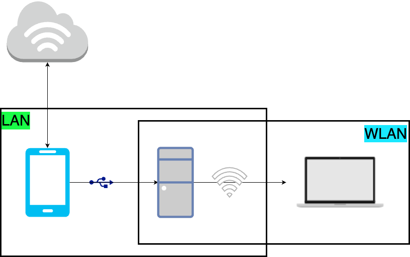

+++
title = 'SSH连接Windows11(终端连接，以及VSCode Remote-SSH连接)'
date = 2024-12-02T15:37:01+08:00
draft = false
comments = false
slug = "SSH连接Windows11"
categories = [
    "Workflow"
]
tags = [
	"Windows",
	"SSH",
	"VSCode"
]
+++

## 环境描述
笔者平时有两台设备：
1. MacBook Pro
2. Windows 11 系统台式机

两台设备放在实验室，mac用来coding和带来带去，mac只有18G运行内存，而且没有CUDA加速，目前来讲很多LLM不支持MPS，所以windows用来跑模型测试。

两台设备处于同一局域网，想要以一种更高效的工作流进行开发，即在mac上coding，在windows11上进行调试。

有三种选择：
1. Microsoft Remote Desktop
	以这种方式连接到Windows11，这样可以有一个**可视化界面**。
    
	**缺点**：
	- 子网是通过手机USB给Windows台式机提供互联网连接，台式机通过开启移动热点的方式给Mac提供互联网和子网。故对于手机基带以及台式机的无线网卡有较高要求。且OSX下需要开启HiDPI才会使屏幕不那么糊，这样直接导致了操作可视化界面时很卡。
	- 这种方式意味着，在Mac上写好的代码，需要**复制到**windows上才能调试，代码的修改同步也成了很大的问题。
2. Github同步
	极其不方便的方式，感觉很愚蠢。
3. VSCode Tunnel
	方便，但是在浏览器里写代码还是感觉很不舒服。而且所有操作需要在微软服务器中转一次，在国内的话很卡、很慢，既然可以走本地内网，为什么不呢？
4. **SSH连接**
	
    优雅且高效的方式，个人觉得是较为标准的工作流。也是接下来将会详细介绍的方法。

## 初步连接
*注：此方式是适用于使用微软账户登陆Windows的方式，学会此方法后，用本地账户登陆到windows的情况只会更简单。*

系统：Windows 11 专业版

前言：由于平时还是会有玩游戏的需求，并且需要用到较多云服务，所以并没有直接使用Windows Server版本。如果是使用微软在线账户登陆的Windows 11，便存在一个问题，SSH登陆到Windows11时**似乎**只能使用在线账户的方式登陆，而不能使用RSA密钥的方式。

1. <kbd>WIN</kbd>+<kbd>S</kbd>搜索“可选功能”，安装`OpenSSH Server`组件，开启`Open SSH`以及设置开机启动。详细教程Google即可。
2. 不出意外的话，上一部操作后已经可以根据`ssh username@IP`的方式登陆到windows。其中`username`可以在windows中打开terminal，根据默认当前路径判断：`C:/User/${username}>`即可。

第一次在终端连接的时候，会出现选项`yes/no/[fingerprint]`，此时要输入`yes`，这样才能使用微软账户登陆到windows，以笔者的尝试经历来看，只能以此方式登陆。

如果能够在终端可以成功连接，那么第一步已经完成！

## 设置默认终端
SSH连接到Windows时，默认使用的是`cmd`而不是`powershell`，Linux用户肯定是不习惯的(虽然Powershell也不会很习惯)，所以需要设置登陆到Powershell。

参考：[官方文档](https://learn.microsoft.com/zh-cn/windows-server/administration/OpenSSH/openssh-server-configuration#configuring-the-default-shell-for-openssh-in-windows)

## VSCode Remote-SSH(有坑！)
这里有一个哭笑不得的坑：终端可以顺利连接到windows，但是VSCode的SSH连接死活连不上。检查details，明明已经连接上了，但是在Windows上安装相关支持组件的时候就会出错。

原因是权限问题，Windows上我是安装了火绒的，**火绒会拦截Powershell的一些安装工作**，所以需要在第一次连接的时候关闭一下火绒，或者手动点一下火绒弹窗的“允许”，这样就可以完美解决。